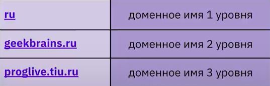
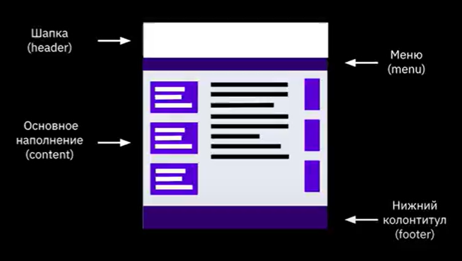
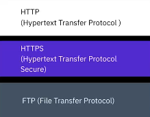
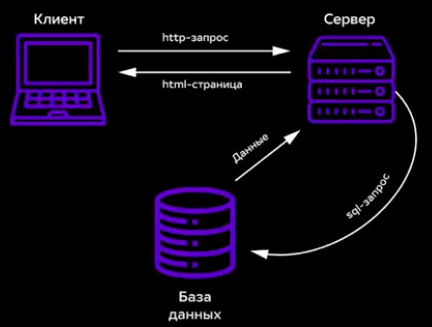
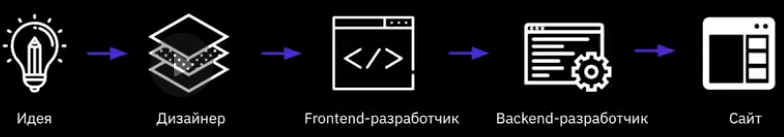
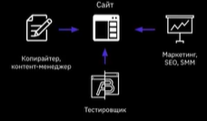
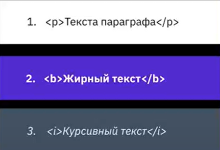
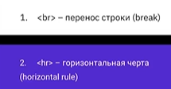

# что такое HTML?

**HTML** (от английского HyperText Markup Language) — это язык гипертекстовой разметки. Он используется для создания и структурирования веб-страниц.

**HTML** помогает определять, как содержимое страницы должно отображаться в браузерах. Это своеобразный каркас, на котором строится страница, включая текст, изображения, ссылки и другие элементы.

# что такое CSS?

**CSS** (Cascading Style Sheets) — это язык описания внешнего вида **HTML**-документа. Он отвечает за то, как выглядят веб-страницы: цвет фона и декоративных элементов, размер и стиль шрифтов. 

**CSS** используется для определения стилей (правил) оформления документов, включая дизайн, вёрстку и вариации макета для различных устройств и размеров экрана.

# Что такое интернет?

**Интернет** — это **глобальная сеть взаимосвязанных компьютеров и устройств**, которая объединяет устройства по всему миру и даёт пользователям возможность обмениваться информацией, общаться друг с другом, вести бизнес и получать доступ к широкому спектру онлайн-услуг.

# Что такое доменные имена?

**Доменное имя** — это **адрес веб-сайта в интернете**, например, google.com или skysmart.ru. 

Оно соответствует определённому IP-адресу сервера и предоставляет пользователям возможность находить нужные ресурсы, не запоминая их IP-адреса.

# Устройства сайта

# Виды сайтов

* **По способу отображения контента**:

* **Статический сайт**. Контент фиксирован и не подлежит изменениям со стороны сервера или браузера. Каждая страница такого сайта — отдельный файл, который возвращает пользователю сервер после запроса. 

* **Динамический сайт**. Веб-сервис, который генерирует весь контент в реальном времени, черпая необходимую информацию из базы данных на сервере. Страницы такого сайта могут отображать разные данные для разных пользователей. 
  * **По размеру**:

* **Одностраничный сайт** (лендинг). Занимает одну страницу, на которой обычно размещается информация о конкретном товаре или услуге. 

* **Многостраничный сайт**. Цель такого сайта — донести до сведения пользователя как можно больше информации по всем направлениям деятельности компании, поэтому он может занимать десятки, а то и сотни страниц. 

  * **По целям и контенту**:

* **Корпоративные сайты**. Главная задача — полномасштабное размещение информации о какой-либо компании или проекте, истории создания, целях и возможностях, качестве товаров и услуг, ценах, контактах и пр.. 

* **Информационные сайты**. Этот вид интернет-сайтов размещает разного рода информацию по тем вопросам, которые интересуют пользователей. 

* **Веб-сервисы**. Крупные интернет-ресурсы, созданные для решения определённых задач: поиска информации, общения и т.д.. 

* **Сайты-представительства**. К ним относятся сайты, которые созданы не для торговли, а только для предоставления каких-то данных. Сюда можно включить почти все сайты госструктур, социальные проекты и др..

# По содержимому 

 

# Основные протаколы

# Схема HTTP-запроса страницы

# Процесс разработки сайтов 

# Процесс разработки сайта

# Парные тэги 

# Одиночные тэги 

# Атребуты тегов 

Атрибуты в HTML играют ключевую роль в предоставлении дополнительной информации о тегах. 
Они помогают уточнить, как элемент должен отображаться или функционировать на веб-странице.
 Атрибуты всегда записываются внутри открывающего тега и состоят из имени и значения, 
 разделенных знаком равенства. Например, <a href="https://example.com">Example</a>.
 